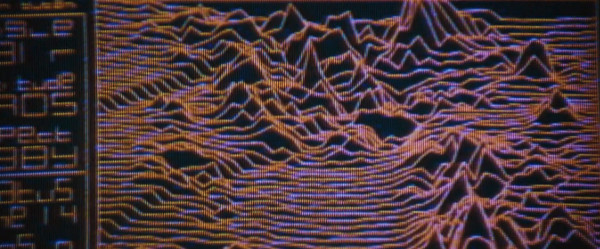
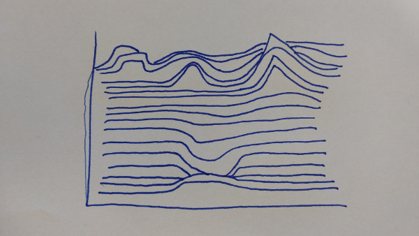

# Example Submission

This visualization is from the movie Alien (1979), directed by Ridley Scott.

This visualization appears on screen as the ship carrying our protagonists
approaches a planetoid; the terrain is unknown, and the computer displays it as
it senses during approach.

The terrain is displayed in a stratified manner; the lines are connected
horizontally (giving the potentially misleading impression that the horizontal
resolution is greater than vertical) and each “layer” appears to be opaque to
the segments behind it.  Most standard visualization tools could generate an
image very similar to this by simply overplotting lines (and staggering them
according to the perspective of the viewpoint), but blocking out the terrain
behind a given line is more complex and difficult.

The data here has likely been generated by taking scan points and connecting
them; while it’s possible that these are irregular in x and y, it looks as
though they are regular in both.

I recreated this visualization by hand, and in doing so I changed the data
somewhat.  I discovered that it’s considerably harder to generate this by hand
than I expected!  I tried to draw out the lines, but the implied perspective
made them appear strange and distorted.

While doing this, I discovered that according to [Tisovˇcík
2012](https://is.muni.cz/th/359691/fi_b/Thesis.pdf) this terrain was generated
on the fly, rather than being stored ahead of time.  It was also the first
terrain used in a movie, although it is contemporaneous with the famous
"Unknown Pleasures" album cover that features a similar visualization of a
pulsar.
